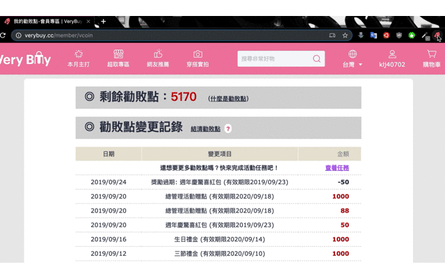

# Verybuy-vcoin-calculator

## Why is this needed
因勸敗點頁面不會幫忙計算即將過期的勸敗點，若能在更早知道即將過期的點數，就能提早規劃它，故隨手寫了個 chrome extension。

## DEMO

## How To Use
1. 下載 [Verybuy-vcoin-calculator](https://mega.nz/#!989UTSoC!w3K2wzsOOBrXOAhPUihcEsdEyJ-bK35iQf0N7Hm0qTIVerybuy-vcoin-calculator "Verybuy-vcoin-calculator")
2. 點擊 [chrome://extensions/](chrome://extensions/ "chrome://extensions/")
3. 點擊左上「**載入未封裝項目**」，選擇剛剛下載的 **Verybuy-vcoin-calculator**
4. 之後進入[勸敗點頁](https://www.verybuy.cc/member/vcoin "勸敗點頁")，點擊插件即可看到即將過期勸敗點。